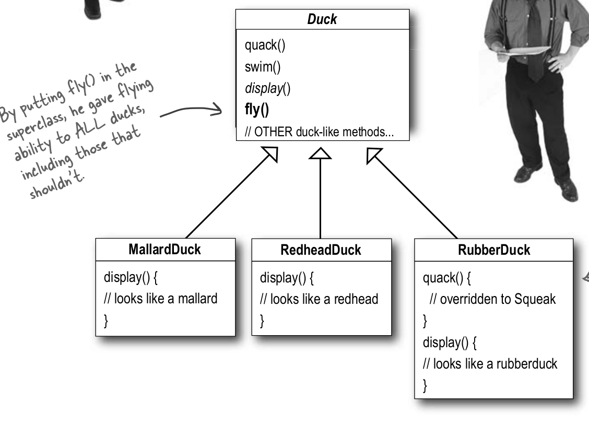
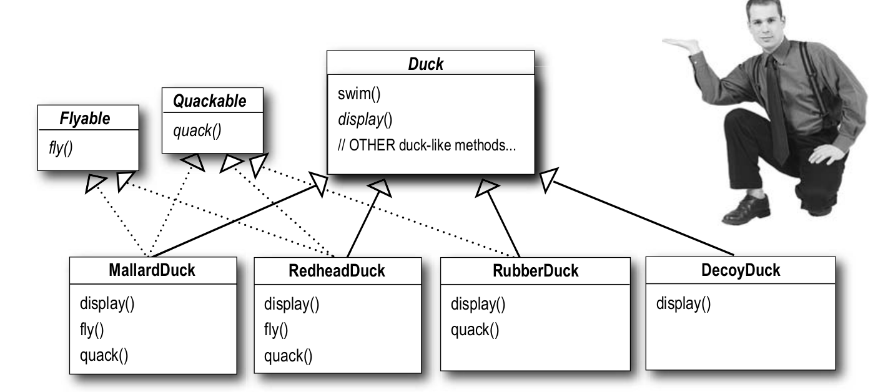
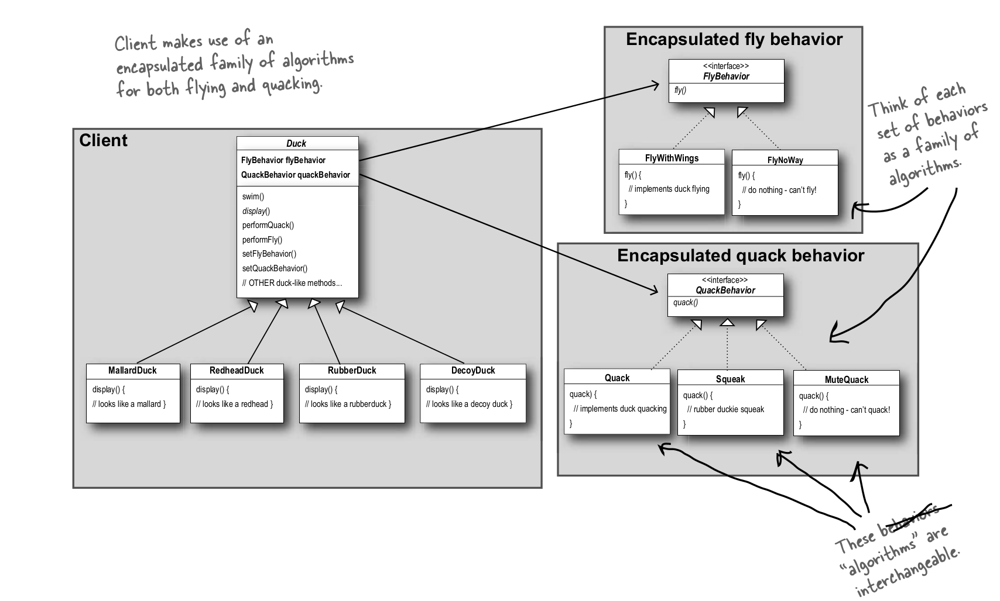

# The Stratigy Pattern:

## Definition

Defines a family of algorithms, encapsulates each one, and makes them interchangeable. Strategy lets the algorithm vary independently from clients that use it.

## Design Principles of this Chapter
1- Encapsulate what varies.

2- Program to an interface, not to implementation.

3- Favor composition over inheritance.

## Example: SimUDuck app
### Mistaken Designs: 
  - Mistaken Design 1:
 
 
  **Why it is wrong?**

This design failed to notice that not all subclasses of Duck should fly. When we added new behavior to the Duck superclass, we were also adding behavior that was not appropriate for some Duck subclasses!

  - Mistaken Design 2:
   
   
  **Why it is wrong?**
  
  It completely destroys code reuse for defined behaviors. So in each instance, we will implement the fly behavior separately, and then re-implement the same behavior for those instances that behave in the same way.

### Correct Design (Using Stratigy Pattern)

  - Diagram : 
  

 **Why it is correct?**
 
 It solves the two problems that the last two design have intrduced:
  - It separates methods that change (behaviors), from methods that don't (states).
  - It allows to reuse behaviors in different ducks, for example, we can use FlyWithWing with MallarDuck and ReadheadDuck.

