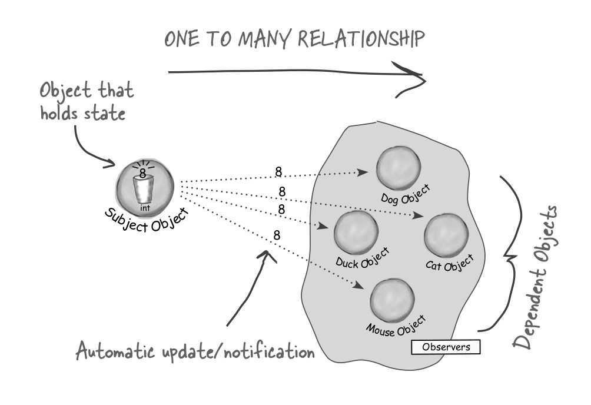
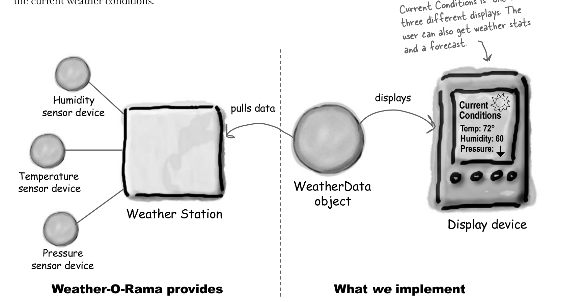
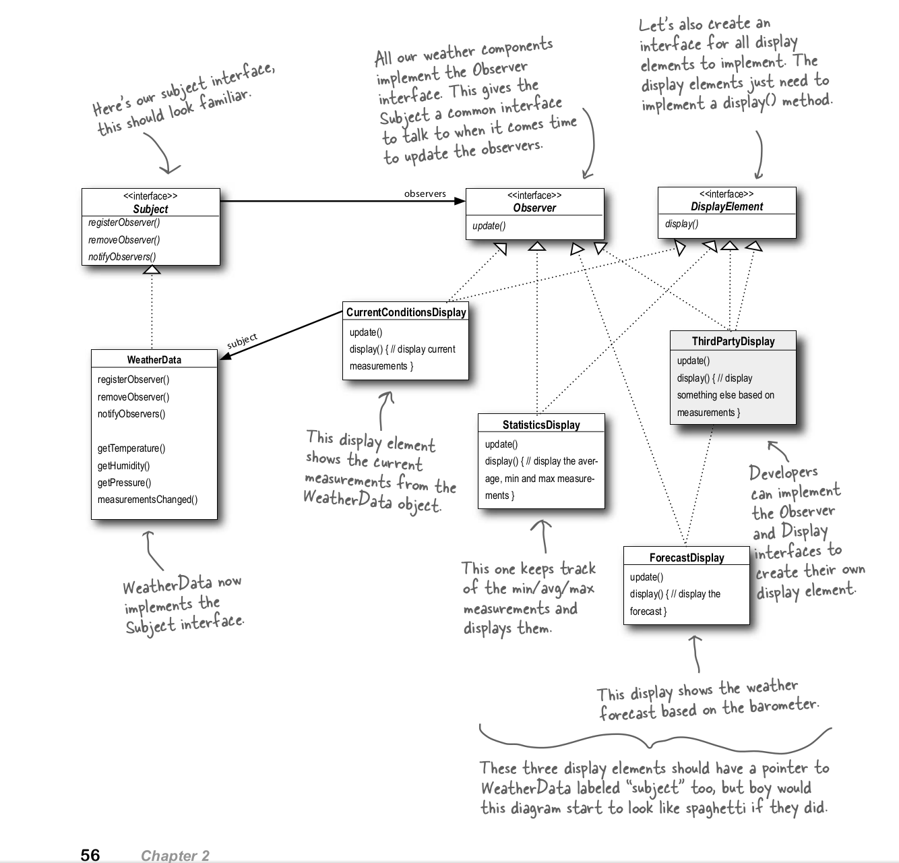

# The Observer Pattern 
## Definition
- defines a one-to-many dependency between objects so that when one object changes state, all of its dependents are notified and updated automatically.
- It is mainly used for implementing distributed event handling systems, in "event driven" software. 
- This pattern perfectly suits any process where data arrives from some input that is not available to the CPU at startup, but instead arrives "at random" (HTTP requests, GPIO data, user input from keyboard/mouse/..., distributed databases and blockchains, ...).
## Components 

1- Subject : is a "stream of events" or "stream source of events"
- It could have more than observer.
- Any subject can register, delete, and notify all observers.

2- Observer: "sinks of events"
- Get updated automatically by subject, as long as it has registered.

## Use Case: Weather-O-Rama
The three players in the system are the weather station (the physical device that acquires the actual weather data), the WeatherData object (that tracks the data coming from the Weather Station and updates the displays), and the display that shows users the current weather conditions.

### Design Weather-O-Rama using Observer Pattern

