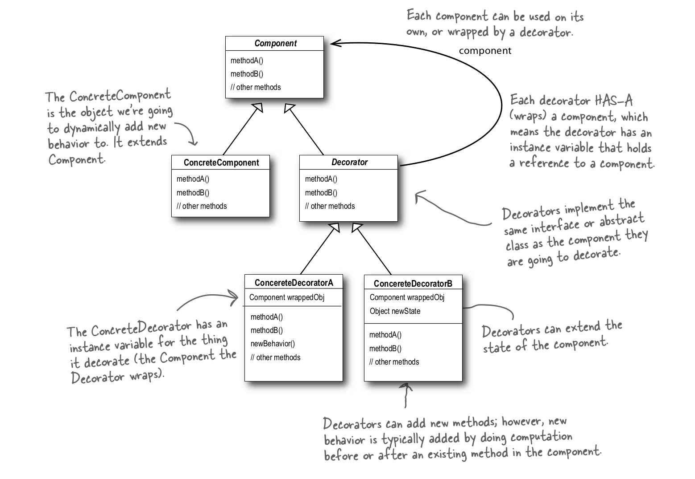
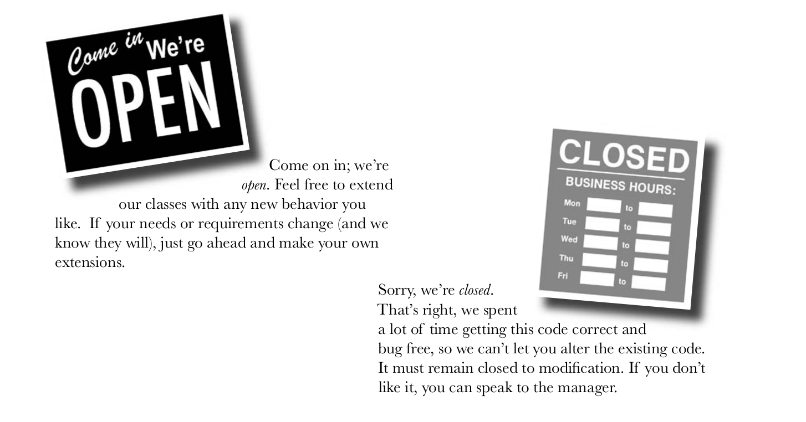
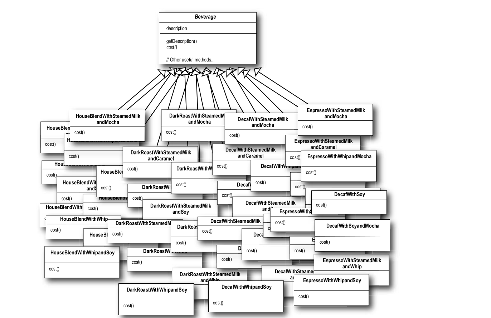
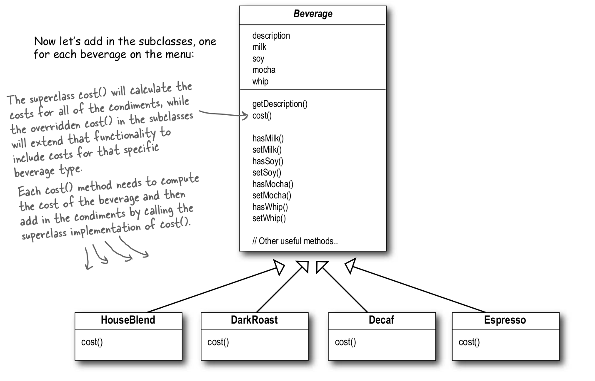
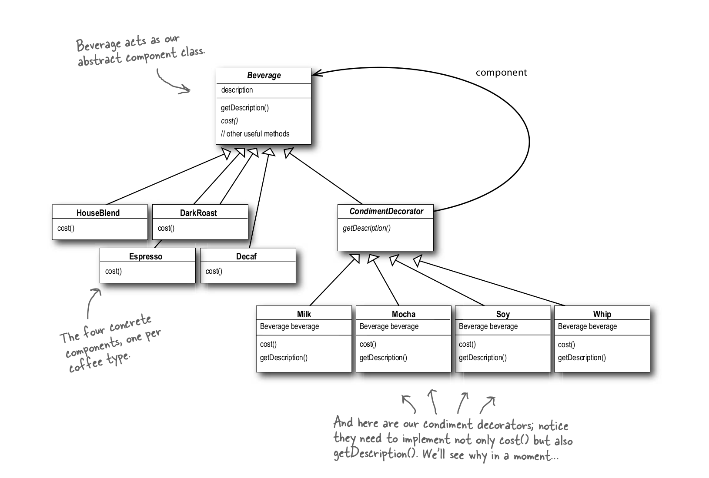

# The Decorator Pattern

## Definition
The Decorator Pattern attaches additional responsibilities to an object dynamically. Decorators provide a flexible alternative to subclassing for extending functionality.

## Architecture

## Important Concept [Open-closed principle]
Classes should be open for extension, but closed for modification.

The goal is to allow classes to be easily extended to incorporate new behavior without modifying existing code.
What do we get if we accomplish this? Designs that are resilient to change and fl exible enough to take on new functionality to meet changing requirements.

## Example: StarBuzz Coffee
### Mistaken Designs 1 :

***Why?***
It’s pretty obvious that this design has created a maintenance nightmare. What happens when the price of milk goes up? What do they do
when they add a new caramel topping? With this design they should update the price in each subclass with milk and/or add the topping+(all drinks) new subclasses.

### Mistaken Designs 1 :
One might say, why do we need all these classes? Can’t we just use instance variables and inheritance in the superclass to keep track of the condiments?

***Why?***
- Price changes for condiments will force us to alter existing code.
- New condiments will force us to add new methods and alter the cost method in the superclass.
- We may have new beverages. For some of these beverages (iced tea?), the condiments may not be appropriate, yet the Tea subclass will still inherit methods like hasWhip().
- What if a customer wants a double mocha?

### Correct Design (Using Decorator Pattern)

